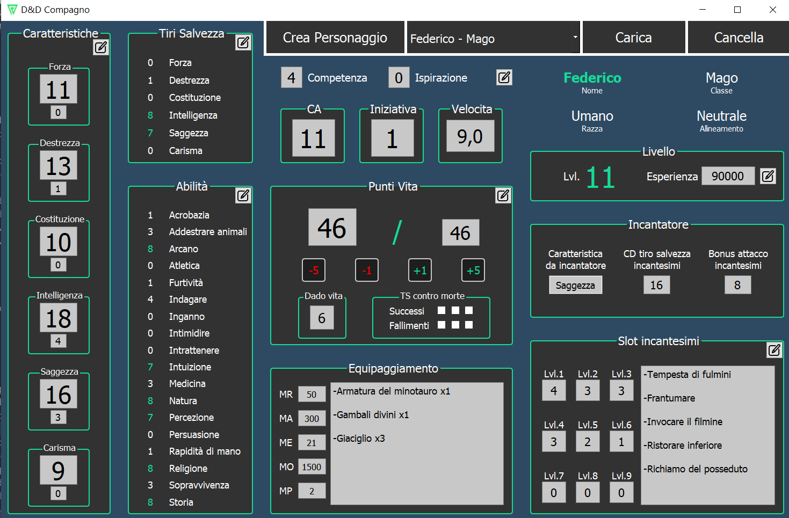

#    DnD Companion

DnD Companion is a desktop application that keep track of stats and progress of your dungeons and dragon board game charachters. 
The application is a pure C++ project developed with the Qt framework using Model-View pattern.

The complete documentation for this project can be found in the [relazione.pdf](relazione.pdf) file.

## Screenshots

